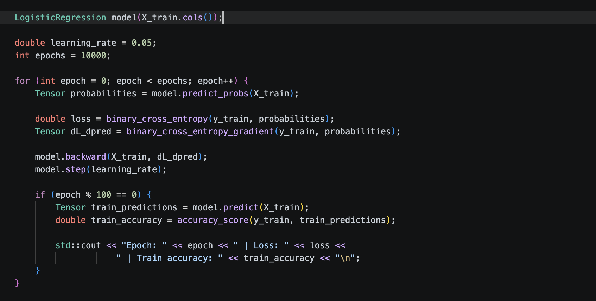

# C++ Machine Learning Library from Scratch

Machine learning library built from scratch using the C++ Standard Library. Implements classical machine learning algorithms alongside deep learning components. The goal is to build the library in a PyTorch-style, where training loops are explicit and the math behind forward passes, gradient calculations, and parameter updates stays visible.

<p align="center">
  
</p>

## Repo Structure
```text
root/
├── build/                      CMake build output.
├── data/                       Small datasets used by examples.
├── examples/                   Model usage examples.
├── include/                    Headers.
├── scripts/                    Python dataset prep and shell scripts.
├── src/                        Source implementations.
│   ├── core/                   Core building blocks.
│   │   ├── activations/        Activation functions and their gradients, also in layer form.
│   │   ├── layers/             Neural network layers.
│   │   ├── loss_functions/     Loss functions and their gradients.
│   │   ├── metrics/            Evaluation metrics.
│   │   ├── utils/              Helper operations.
│   │   ├── matrix.cpp          Matrix class and operations (No longer used).
│   │   └── tensor.cpp          Tensor class and operations.
│   ├── models/                 Model implementations.
│   ├── optim/                  Optimizers and parameter update logic (Not used right now).
│   └── preprocessing/          Data loading, splitting, and scaling.
└── tests/                      Correctness checks for core components.
```

## Implemented Classical Machine Learning Algorithms
- [x] Linear Regression
- [x] Logistic Regression
- [ ] Ridge / Lasso / Elastic Net
- [x] Perceptron
- [x] ADALINE
- [x] Softmax Regression
- [x] K-Nearest Neighbors
- [ ] K-Nearest Neighbors Regressor
- [x] Gaussian Naive Bayes
- [ ] Multinomial Naive Bayes
- [x] Decision Tree Classifier
- [ ] Decision Tree Regressor
- [x] Random Forest Classifier
- [ ] Random Forest Regressor
- [ ] Gradient Boosted Trees
- [ ] Linear SVM
- [ ] K-Means Clustering
- [ ] PCA

## Neural Network Components
- [x] Linear Layer
- [x] Sigmoid
- [x] ReLU
- [x] Leaky ReLU
- [x] tanh
- [x] GeLU
