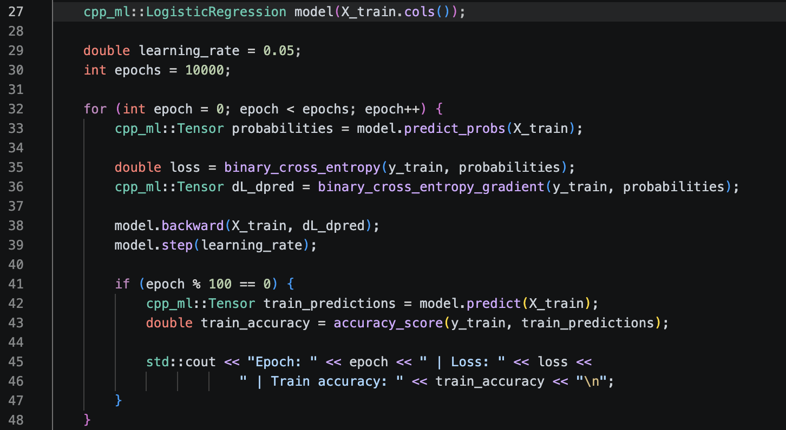

# C++ Machine Learning Library from Scratch

Machine learning library built from scratch using the C++ Standard Library. Implements classical machine learning algorithms alongside deep learning components. The goal is to build the library in a PyTorch-style, where training loops are explicit and the math behind forward passes, gradient calculations, and parameter updates stays visible.

<p align="center">
  
</p>

## Usage 

`cpp_ml` is a C++17 Machine Learning Library built from scratch.

Public headers are included through the `cpp_ml/` prefix:

```cpp
#include "cpp_ml/cpp_ml.hpp"
```

All of the library code lives in the `cpp_ml` namespace:

```cpp
#include "cpp_ml/cpp_ml.hpp"

int main() {
    cpp_ml::Tensor X = cpp_ml::Tensor::from_vector({
        {1.0},
        {2.0},
        {3.0}
    });

    cpp_ml::Tensor y = cpp_ml::Tensor::from_vector({
        {2.0},
        {4.0},
        {6.0}
    });

    cpp_ml::LinearRegression model(1);
    model.fit(X, y, 1000, 0.01);

    cpp_ml::Tensor preds = model.predict(X);
}
```

## Requirements

- C++17 compiler
- CMake 3.16+
- clang++ or g++

## Build

```bash
cmake -S . -B build -DCMAKE_CXX_COMPILER=clang++
cmake --build build
```

## Repo Structure

```text
root/
├── build/                      CMake build output.
├── data/                       Small datasets used by examples.
├── examples/                   Model usage examples.
├── include/                    Headers.
├── scripts/                    Python dataset prep and shell scripts.
├── src/                        Source implementations.
│   ├── core/                   Core building blocks.
│   │   ├── activations/        Activation functions and their gradients, also in layer form.
│   │   ├── layers/             Neural network layers.
│   │   ├── loss_functions/     Loss functions and their gradients.
│   │   ├── metrics/            Evaluation metrics.
│   │   ├── utils/              Helper operations.
│   │   ├── matrix.cpp          Matrix class and operations (No longer used).
│   │   └── tensor.cpp          Tensor class and operations.
│   ├── models/                 Model implementations.
│   ├── optim/                  Optimizers and parameter update logic (Not used right now).
│   └── preprocessing/          Data loading, splitting, and scaling.
└── tests/                      Correctness checks for core components.
```

## Classical Machine Learning Algorithms

- [x] Linear Regression
- [x] Logistic Regression
- [ ] Ridge / Lasso / Elastic Net
- [x] Perceptron
- [x] ADALINE
- [x] Softmax Regression
- [x] K-Nearest Neighbors
- [ ] K-Nearest Neighbors Regressor
- [x] Gaussian Naive Bayes
- [ ] Categorical Naive Bayes
- [ ] Bernoulli Naive Bayes
- [ ] Mixed Naive Bayes
- [x] Decision Tree Classifier
- [ ] Decision Tree Regressor
- [x] Random Forest Classifier
- [ ] Random Forest Regressor
- [ ] Gradient Boosted Trees
- [ ] Linear SVM
- [ ] K-Means Clustering
- [ ] PCA

## Neural Network Components

### Layers

- [x] Linear Layer
- [ ] Conv1D
- [ ] Conv2D
- [ ] MaxPool1D
- [ ] MaxPool2D
- [ ] Flatten
- [ ] Dropout
- [ ] BatchNorm

### Activations

- [x] Sigmoid
- [x] ReLU
- [x] Leaky ReLU
- [x] tanh
- [x] GeLU
- [ ] Softmax (Currently only implemented as a function)

## Loss Functions

- [x] Mean-Square Error (MSE)
- [x] Mean-Absolute Error (MAE)
- [ ] Huber Loss
- [x] Binary Cross-Entropy (BCE)
- [x] Cross-Entropy

## Utilities

- [x] Sequential
- [ ] Weight Initialization
- [ ] Model Save / Load
- [ ] Train / Eval Mode

## Current Status

This project is still under development.

## License

MIT License